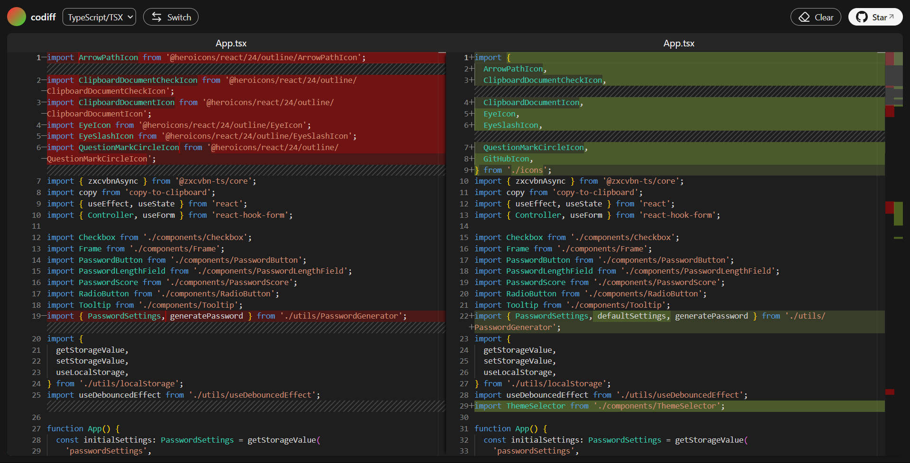

## [codiff](https://codiff.vercel.app)

codiff is a diff tool that can find the difference between two text documents. Just paste or drag and drop.

This is an improved recreation of [Text Compare!](https://text-compare.com/)

